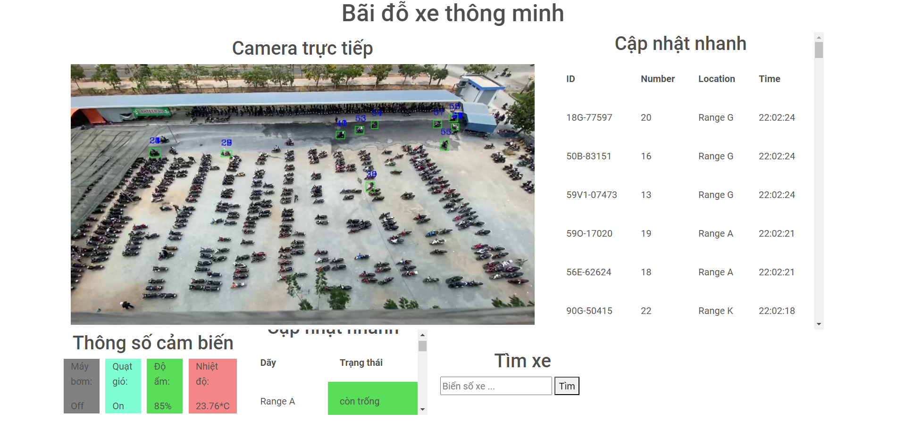
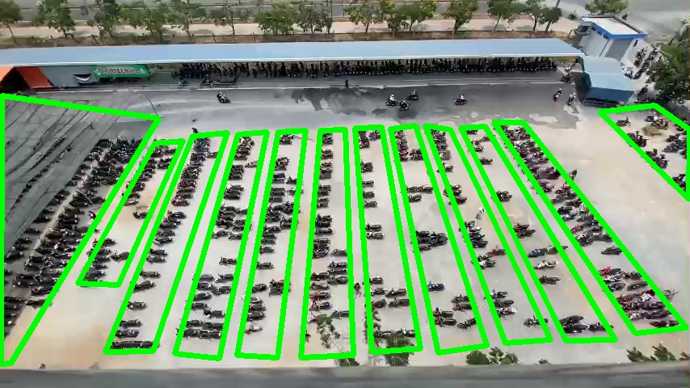
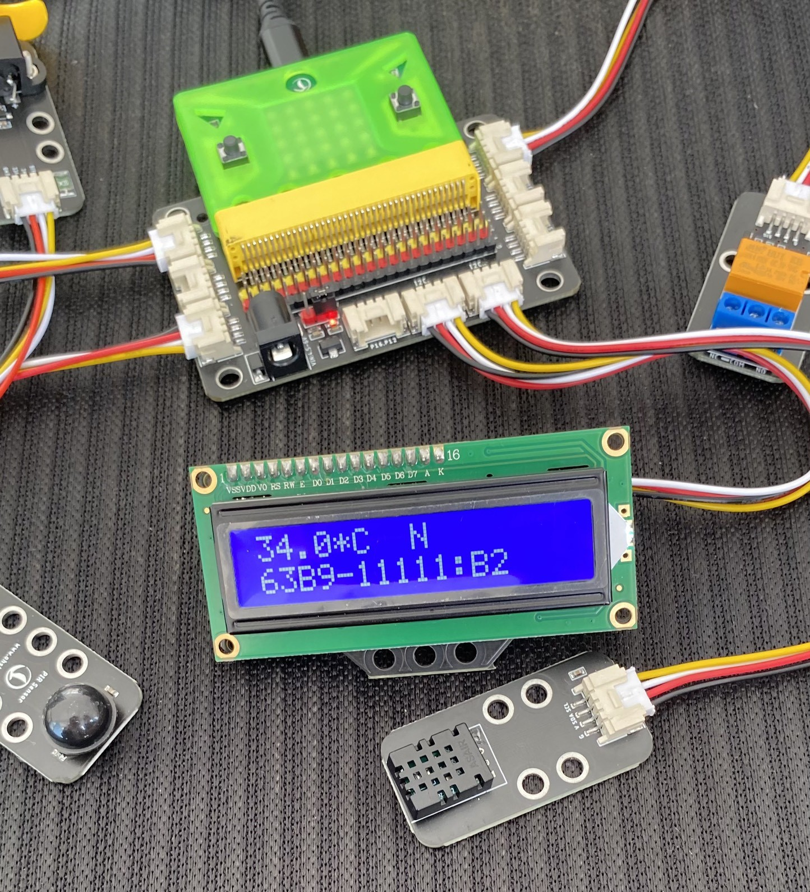
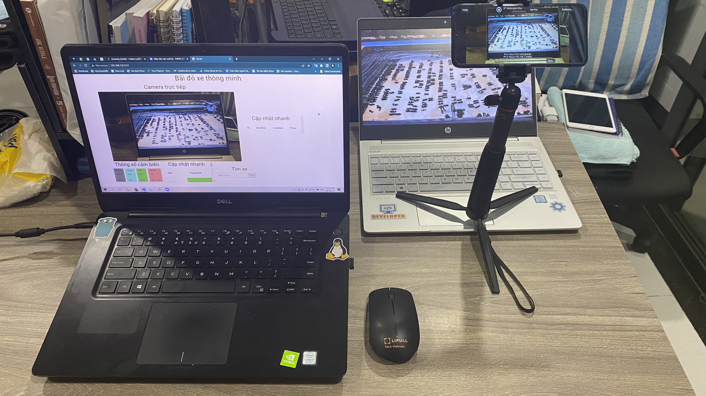

<h1 style="text-align:center;">Smart Parking Lot</h1>

## Information details
<ul>
  <li>Subject name: Multidisciplinary Project</li>
  <li>Description: A system for vehicle tracking in parking lot</li>
  <li>Year: 2023</li>
  <li>Member:
  <ol>
    <li>Doan Tran Cao Tri (Leader)</li>
    <li>Nguyen Phuc Khang</li>
    <li>Chau Dang Minh</li>
  </ol>
  </li>
</ul>

## Setup

1. Install requirements.txt
```bash
pip install -r requirements.txt
```
2. Run:

+ Normal run:    
```bash   
python server/server.py  
```
+ Simulate run:   
```bash  
python server/server.py simulate  
```
+ Clear ranges:     
```bash
python server/server.py clear ranges  
```
+ Clear vehicles:   
```bash
python server/server.py clear vehicles  
```
+ Setup new ranges:     
```bash
python server/server.py init_range  
```
+ View our frames:   
```bash
python server/server.py show_frame  
```

**Remember**:
+ Run VPN to ignore daily limit from plateAPI  
+ Open Webcam IP and correct its IP 
+ Normal run: run with iot devices, adafruit server
+ Simulate run: run with simulate data callback 

=> Check if the server is running: go to browser, access your IP:Port 5050  

## Project Information
1. Language and technology: Python, OpenCV, Flask Framework server, Webcam IP, Adafruit server
2. Algorithm: Centroid and Euclidean tracker

## UI
<div style="text-align:center">

<p>Our results</p>
</div>

<div style="text-align:center">

<p>System setup ranges in parking lot</p>
</div>

<div style="text-align:center">

<p>Connect to iot devices through Yolobit</p>
</div>

<div style="text-align:center">

<p>Using IP Webcam in our systems</p>
</div>
